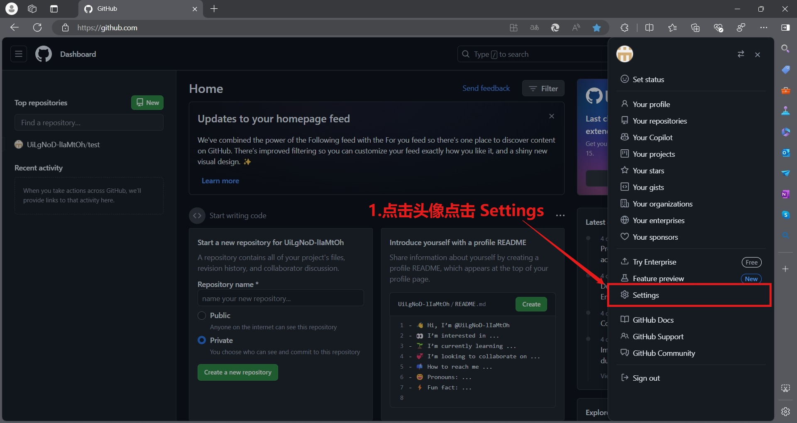
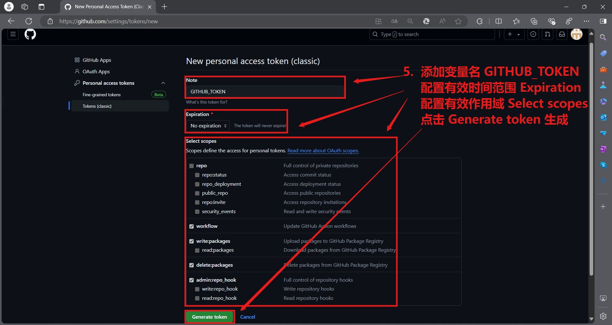
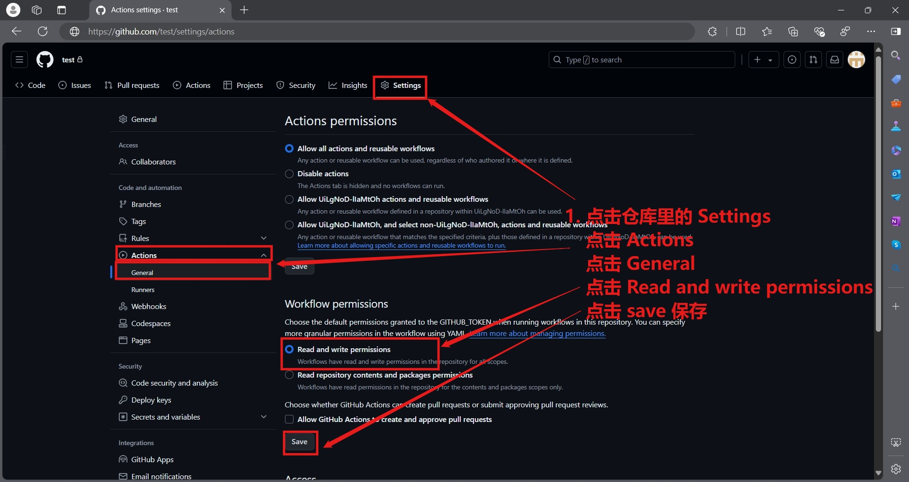

# docker-amd64-custom-ubuntu-topfreeproxies

构建特殊的ubuntu镜像运行容器，获取最终配置节点文件为我所用，主要用于学习提升技术，咳咳别想太多  
    
<a href="https://star-history.com/#UiLgNoD-lIaMtOh/docker-amd64-custom-ubuntu-topfreeproxies&Date">
  <picture>
    <source media="(prefers-color-scheme: dark)" srcset="https://api.star-history.com/svg?repos=UiLgNoD-lIaMtOh/docker-amd64-custom-ubuntu-topfreeproxies&type=Date&theme=dark" />
    <source media="(prefers-color-scheme: light)" srcset="https://api.star-history.com/svg?repos=UiLgNoD-lIaMtOh/docker-amd64-custom-ubuntu-topfreeproxies&type=Date" />
    
  </picture>
</a>

## ghcr.io
镜像仓库链接：[https://github.com/UiLgNoD-lIaMtOh/docker-amd64-custom-ubuntu-topfreeproxies/pkgs/container/custom-ubuntu-topfreeproxies](https://github.com/UiLgNoD-lIaMtOh/docker-amd64-custom-ubuntu-topfreeproxies/pkgs/container/custom-ubuntu-topfreeproxies)  

## 使用方法，节点越来越大 topfreeproxies/README.md 已经不能显示了，唉，好痛苦
将以下订阅链接导入相应客户端即可。链接中大部分为 SS 协议节点，少量 Vmess, Trojan ,SSR 协议节点，建议选择协议支持完整的客户端。

- [多协议Base64编码](https://raw.githubusercontent.com/UiLgNoD-lIaMtOh/docker-amd64-custom-ubuntu-topfreeproxies/master/topfreeproxies/Eternity)
- [Clash](https://raw.githubusercontent.com/UiLgNoD-lIaMtOh/docker-amd64-custom-ubuntu-topfreeproxies/master/topfreeproxies/Eternity.yaml)
- [Singbox](https://raw.githubusercontent.com/UiLgNoD-lIaMtOh/docker-amd64-custom-ubuntu-topfreeproxies/master/topfreeproxies/singbox-config.json)
- [Singbox-format](https://raw.githubusercontent.com/UiLgNoD-lIaMtOh/docker-amd64-custom-ubuntu-topfreeproxies/master/topfreeproxies/singbox-config-format.json)

另有国内加速链接：

- [多协议Base64编码](https://fastly.jsdelivr.net/gh/UiLgNoD-lIaMtOh/docker-amd64-custom-ubuntu-topfreeproxies@master/topfreeproxies/Eternity)
- [Clash](https://fastly.jsdelivr.net/gh/UiLgNoD-lIaMtOh/docker-amd64-custom-ubuntu-topfreeproxies@master/topfreeproxies/Eternity.yaml)
- [Singbox](https://fastly.jsdelivr.net/gh/UiLgNoD-lIaMtOh/docker-amd64-custom-ubuntu-topfreeproxies@master/topfreeproxies/singbox-config.json)
- [Singbox-format](https://fastly.jsdelivr.net/gh/UiLgNoD-lIaMtOh/docker-amd64-custom-ubuntu-topfreeproxies@master/topfreeproxies/singbox-config-format.json)

## 描述
1.为了实现 actions workflow 自动化 docker 构建运行，需要添加 `GITHUB_TOKEN` 环境变量，这个是访问 GitHub API 的令牌，可以在 GitHub 主页，点击个人头像，Settings -> Developer settings -> Personal access tokens -> Tokens (classic) -> Generate new token -> Generate new token (classic) ，设置名字为 GITHUB_TOKEN 接着要配置 环境变量有效时间，勾选环境变量作用域 repo write:packages workflow 和 admin:repo_hook 即可，最后点击Generate token，如图所示

  

2.赋予 actions[bot] 读/写仓库权限，在仓库中点击 Settings -> Actions -> General -> Workflow Permissions -> Read and write permissions -> save，如图所示

3.转到 Actions  

    -> Clean Git Large Files 并且启动 workflow，实现自动化清理 .git 目录大文件记录  
    -> Docker Image Build and Deploy Images to GHCR CI 并且启动 workflow，实现自动化构建镜像并推送云端  
    -> Remove Old Workflow Runs 并且启动 workflow，实现自动化清理 workflow 并保留最后三个    

4.目录结构：

    .                                     # 这个是根目录
    ├── .github                           # 这个是github虚拟机项目
    │   └── workflows                     # 这个是工作流文件夹
    │       ├── docker-image.yml          # 这个是docker构建编译流文件
    │       └── remove-old-workflow.yml   # 这个是移除缓存流文件
    ├── Dockerfile                        # 这个是构建docker镜像所需Dockerfile
    ├── README.md                         # 这个是项目说明文件
    ├── topfreeproxies                    # 这个是大佬 aiirobyte 的项目，其原理完全不懂
    │   ├── Eternity                      # 这个是配置文件集合体
    │   ├── Eternity.yaml                 # 这个是配置文件集合体
    │   ├── sing-box-subscribe.bak        # 这个是大佬 Toperlock 的项目，其原理完全不懂
    │   ├── singbox-config.json           # 这个是配置文件集合体
    │   ├── LICENSE                       # 这个是项目协议吧？
    │   ├── README.md                     # 这个是项目说明
    │   ├── mihomos                       # 这个是mihomo代理工具
    │   ├── mihomo.gz                     # 这个是mihomo压缩包
    │   ├── start.sh                      # 这个是项目启动脚本
    │   ├── sub                           # 这个是节点集合体
    │   │   ├── list                      # 这个是节点列表存放目录
    │   │   ├── sub_list.json             # 这个是节点配置文件
    │   │   ├── sub_merge.txt             # 这个是节点整合文件
    │   │   ├── sub_merge_base64.txt      # 这个是节点整合转码文件
    │   │   └── sub_merge_clash.yaml      # 这个是节点整合代理文件
    │   ├── update                        # 这个是节点更新目录
    │   └── utils                         # 这个是项目工具目录
    │       ├── Country.mmdb              # 这个是项目代理列表
    │       ├── __pycache__               # 这个是python缓存文件目录？
    │       ├── config.ini                # 这个是工具配置文件
    │       ├── litespeedtest             # 这个是大佬 xxf098 的 LiteSpeedTest 节点测速项目
    │       ├── main.py                   # 这个是主程序脚本
    │       ├── scripts                   # 这个是脚本存放目录
    │       ├── sub_merge.py              # 这个是节点整合脚本
    │       ├── sub_update.py             # 这个是根节点更新脚本
    │       └── subconverter              # 这个是大佬 tindy2013 的 subconverter 节点整合项目
    ├── docker-compose.yml                # 这个是 docker-compose 构建运行的 yml 文件
    ├── init.sh                           # 这个是 docker 构建镜像内置脚本
    └── requirements.txt                  # 这个是所需 python 环境的第三方模块

## 依赖
    amd64 设备
    docker 程序
    docker-compose 程序
    我目前能想到的必要程序就这些吧

## 构建命令
### 注意
   
    本项目依赖核心是 /topfreeproxies 项目目录
    github 里的 docker-compose.yml 之所以挂载了 /topfreeproxies 是因为 github 项目里面有这个 topfreeproxies 目录
    如果你想在本地 docker-compose 环境中运行这个项目就删掉 - ./topfreeproxies:/topfreeproxies 替换为 - ./topfreeproxies:/root/topfreeproxies
    这样你才能得到订阅文件的输出，因为我写的脚本输出目录是 /root/topfreeproxies 而在 github 里无所谓的。
    言尽于此，唉，我一直过的不好，我受够了，就说这吧。唉

### 看完注意后，构建运行 custom-ubuntu-topfreeproxies ，也可以根据自定义需求爆改脚本
    # clone 项目
    git clone https://github.com/UiLgNoD-lIaMtOh/docker-amd64-custom-ubuntu-topfreeproxies.git
    # 进入目录
    cd docker-amd64-custom-ubuntu-topfreeproxies
    # 无缓存构建
    docker-compose build --no-cache
    # 构建完成后 后台启动 等待 custom-ubuntu-topfreeproxies 环境编译打包，之后这个容器会终止
    docker-compose up -d --force-recreate
    # 也可以查看日志看看有没有问题 ,如果失败了就再重新尝试看看只要最后不报错就好。
    docker-compose logs -f

# 新增
1.clone sing-box-subscribe.git 订阅 clash/v2ray 转换 singbox

# 注意
多人 fork 本项目且一起运行 actions 时，可能会导致本人项目被ban掉，所以，你可以创建新项目，把文件复制过去，自己享用

# 声明
本项目仅作学习交流使用，用于查找资料，学习知识，不做任何违法行为。所有资源均来自互联网，仅供大家交流学习使用，出现违法问题概不负责。

## 感谢
~~大佬 Dreamacro：[https://github.com/Dreamacro/clash](https://github.com/Dreamacro/clash)~~  
大佬 MetaCubeX：[https://github.com/MetaCubeX/mihomo](https://github.com/MetaCubeX/mihomo)  
大佬 aiirobyte：[https://gitlab.com/aiirobyte/topfreeproxies](https://gitlab.com/aiirobyte/topfreeproxies)  
大佬 xxf098：[https://github.com/xxf098/LiteSpeedTest](https://github.com/xxf098/LiteSpeedTest)  
大佬 tindy2013：[https://github.com/tindy2013/subconverter](https://github.com/tindy2013/subconverter)  
大佬 Loyalsoldier：[https://github.com/Loyalsoldier/geoip](https://github.com/Loyalsoldier/geoip)  
大佬 Toperlock：[https://github.com/Toperlock/sing-box-subscribe](https://github.com/Toperlock/sing-box-subscribe)  
